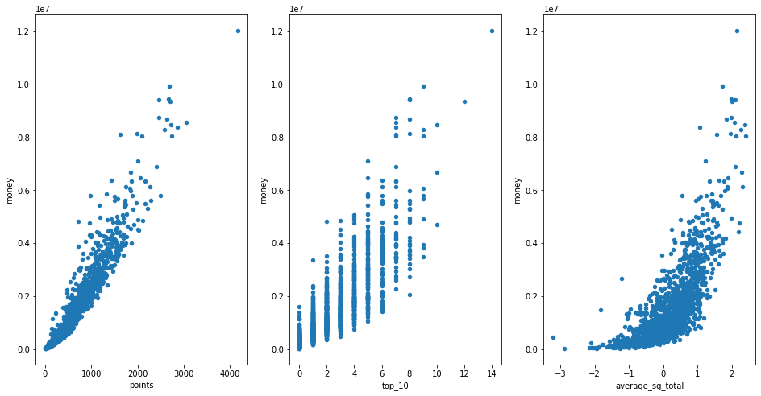

# Golf Sponsorship Modeling

**Authors:** Elliott Iturbe, Cameron DeArman , Alex Valencia 

## Overview
The goal of this project is to create the best models for owners of a small company in order for them to make a business decision on which golfer they wish to sponsor. Descriptive analyses of data on previous statistics revealed that our models would take in a number of features involving all aspects of the game of golf.

## Business Problem
Small company would like to sponsor a golfer and needs to know how impactful their season will be. To help them in this area, we will create multiple models to help predict different targets (money, points, and winners) in order to help them in this decision proccess.

## Data
We examined data on rounds, gir, average_putts, average_scrambling, average_score, points, top_10, average_sg_putts, average_sg_total, sg:ott, sg:apr, sg:arg, distance_fairway, and winners against **money**.

We examined data on rounds, fairway_percentage, year, avg_distance, gir, average_putts, average_scrambling, average_score, top_10, average_sg_putts, average_sg_total, sg:ott, sg:apr, sg:arg, and money against **winners**.

We also examined data on rounds, gir, average_putts, average_scrambling, average_score, money, top_10, average_sg_putts, average_sg_total, sg:ott, sg:apr, sg:arg, distance_fairway, and winners against **point_range**.


## Methods
Our process started with exploring the data set provided to obtain a stronger understanding of what information we were working with. After some initial analysis of the data, we replaced a small handful of null values, combined columns in various ways to give us a new featured engineered column, and changed the datatypes for some of the columns in the data set.

This visualization shows the three most correlated values to **money**.



This is a visual illistrates the correlation between the price of the house and the date sold.


This visuals x-axis is the predicted values and the y-axis is the true values for the baseline model.


This visuals x-axis is the predicted values and the y-axis is the true values for the final model.


During development we used a basic baseline model for all of our three models which yielded various scores including accuracy, precision and recall based on which was the appropriate score for the model. For all our models we tested, please refer back to the baseline models for score comparison. 


## Results
After a good amount of trial and error in the **money** model, we arrived at our final advanced XGBoost model which yielded the following Accuracy scores: training = .956, validation = .955, and test = .921; the following Precision scores: training = .965, validation = .971, and test = .935; and the following Recall scores: training = .946, validation = .935, and test = .910.

After creating a decent baseline model for **winners**, we arrived at a final Support Vector Machine model which yielded the following Accuracy scores: training = .894, validation = .895, and test = .895.

For our last model on **point_range**, the baseline was not very helpful so we had a lot of work to do and ultimatly landed on a GridSearch using a Decision Tree that gave us the following Accuracy scores: training = .897, validation = .830, and test = .780.


# Next Steps
One idea we would like to pursue in the future is to take all our models and combine them in a function. You would use this function to write in a name and year, and then get back a 'Yes' or 'No' based on whether or not he made enough money, fell in the correct range of points, and had a chance to be a winner. In addition, we want to expand our understanding of our **point_range** and how we can use our range to predict who would then be in the upper-quartile range in future seasons. We also want to put in a single players stats and be told by the model based on our parameters whether we should sponsor them or not. 

## Conclusions
After many models and tries (trials?) we created three final models. The models created have given the company three diffrent measures to evaluate a player, but ultimatly making the decision to sponsor a player comes down to more than the models. A player's name and year can be put through the functions provided which gives an output on if they'll make enough money, fall in the correct points range, as well as if they have a chance to be a winner. However, the list of players that pass these tests are then up for debate among the company based on various other attributes such as character and/or social media success. 


## For More Information
Please review our full analysis in [our Jupyter Notebook Money](./report.ipynb), [our Jupyter Notebook Winners](./report.ipynb), [our Jupyter Notebook Points](./report.ipynb) or our [presentation](./microsoftmovieanalysispowerpoint.pdf).

For any additional questions, please contact **Elliott Iturbe at eaiturbe@bsc.edu, Cameron DeArman at cmdearma@bsc.edu, or Alex Valencia at asvalencia1688@gmail.com**

## Repository Structure

```
├── data                                  <- data files used for analyses
├── images                                <- visualizations created
├── notebooks                             <- code written for project with explanation, as well as working ├──notebooks of members
├── microsoftmovieanalysispowerpoint.pdf  <- PDF version of powerpoint
└── README.md                             <- overview of project
```
